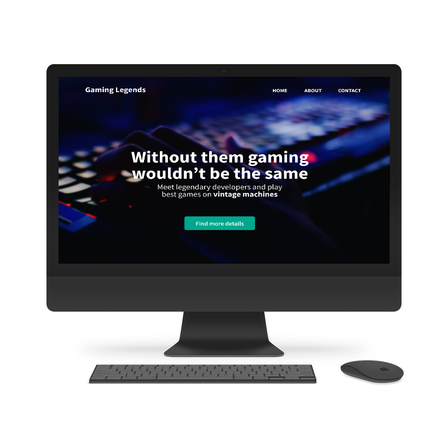

# Getting Started Conference App :cat:

This project is website dedicated to gamers conference and games creators. It was created to enchence team working and React skills. In this project we are using headless CMS Strapi as a source for data on website. 

## Usage :wrench:

### In order to run this application you have to prepare some things first.
1. Extract app_cms
2. Open folder in which you have extracted zip
3. Run **npm install**
4. After installing you have to start CMS by typing **npm start**

### After this preparations you are ready to start Conference App.
1. In main folder run **npm install**
2. Then run **npm start** 

## Design :computer:

Created in Figma, used free stock photos from Pexels

## Contributions :rocket:

Project created by Janek Naklicki & Filip Cichowski

## Social media :camera:

Facebook: https://www.facebook.com/profile.php?id=100075094535658

## License :earth_africa:

Licensed under MIT License
